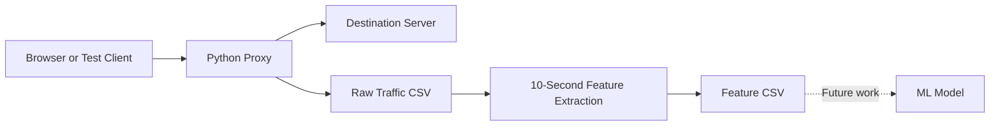

# ML-Based Network Anomaly Detection Proxy

A Python proxy server that captures HTTP and HTTPS connection metadata and converts it into fixed-window features for a future machine-learning anomaly detector.

This is an **in-progress cybersecurity and machine-learning project**. The proxy, traffic logging, controlled anomaly generator, and feature-extraction stages are implemented. The ML training and real-time prediction stages have not been implemented yet.

## Current Progress

### Completed

- Concurrent Python proxy server
- HTTP request forwarding
- HTTPS `CONNECT` tunneling
- Raw connection and request logging
- Separate HTTP response-time and HTTPS tunnel-duration measurements
- Thread-safe traffic collection
- Fixed 10-second tumbling windows
- Per-client feature extraction
- Normal and anomalous dataset collection
- Controlled localhost anomaly generator
- Initial dataset validation

### Still to Do

- Collect additional independent data sessions
- Balance and diversify normal and anomalous traffic
- Create train/test datasets using session-based splitting
- Train a Random Forest baseline
- Evaluate precision, recall, F1-score, and confusion matrix
- Save the selected model
- Integrate real-time predictions with the proxy

## Project Structure

```text
mitacs-proxy-anomaly-detection/
├── proxy_server.py
├── anomalous_generator.py
├── requirements.txt
├── .gitignore
├── README.md
├── data/
│   ├── README.md
│   ├── raw/
│   │   ├── traffic_normal_01.csv
│   │   └── traffic_anomalous_01.csv
│   └── features/
│       ├── features_normal_01.csv
│       └── features_anomalous_01.csv
├── models/                 # Added during the ML stage
└── notebooks/              # Optional analysis notebooks
```

The `raw/` and `features/` folders are created automatically when the proxy starts. CSV filenames depend on the session name supplied on the command line.

## Data Pipeline



## Output Files

| Folder | Contents | Purpose |
|---|---|---|
| `data/raw/` | One row per request or connection | Auditing and future feature engineering |
| `data/features/` | One row per client per completed window | Future ML training and evaluation |

The ML model will use the feature CSV files, not the raw traffic CSV files directly.

## Feature Dataset

Each feature row describes one active client during one fixed window.

| Column | Description |
|---|---|
| `window_start` | Start time of the window |
| `window_end` | End time of the window |
| `client_ip` | Client address |
| `requests_per_second` | Average connection/request rate |
| `total_connections` | Total records in the window |
| `failed_connections` | Failed connections in the window |
| `failure_rate` | Failed connections divided by total connections |
| `request_bytes` | Bytes sent by the client |
| `response_bytes` | Bytes received from destinations |
| `bytes_per_second` | Combined traffic volume per second |
| `average_response_time` | Mean response time for HTTP records |
| `average_tunnel_duration` | Mean duration of HTTPS tunnels |
| `unique_destinations` | Distinct destination hosts contacted |
| `label` | `normal` or `anomalous` |

For future model training, `window_start`, `window_end`, and `client_ip` should not normally be used as input features. The `label` column is the prediction target.

## Installation

Clone the repository and enter its directory:

```bash
git clone <your-repository-url>
cd mitacs-proxy-anomaly-detection
```

Create and activate a virtual environment:

```bash
python -m venv .venv
```

Windows PowerShell:

```powershell
.venv\Scripts\Activate.ps1
```

Linux or macOS:

```bash
source .venv/bin/activate
```

Install the dependency used by the anomaly generator:

```bash
pip install -r requirements.txt
```

The proxy itself uses only Python standard-library modules.

## Collecting Normal Traffic

Start the proxy with a normal label and a unique session name:

```bash
python proxy_server.py --label normal --session normal_01
```

Configure the browser to use `127.0.0.1` on port `8082` as its HTTP and HTTPS proxy, then browse normally.

This run creates:

```text
data/raw/traffic_normal_01.csv
data/features/features_normal_01.csv
```

Do not reuse a session name for a different class because the program appends to an existing file.

## Collecting Controlled Anomalous Traffic

Only test systems that you own or have explicit permission to test.

Start a local test server in the first terminal:

```bash
python -m http.server 8000 --bind 127.0.0.1
```

Start the proxy in the second terminal:

```bash
python proxy_server.py --label anomalous --session anomalous_01
```

Run the controlled generator in the third terminal:

```bash
python anomalous_generator.py
```

The default generator sends request bursts only to `127.0.0.1:8000` through the proxy. Its main settings can be changed through command-line arguments:

```bash
python anomalous_generator.py \
  --duration 60 \
  --requests-per-burst 40 \
  --workers 10
```

The generator intentionally rejects non-localhost targets.

## Useful Proxy Options

```bash
python proxy_server.py --help
```

| Option | Default | Purpose |
|---|---:|---|
| `--label` | `normal` | Feature label: `normal` or `anomalous` |
| `--session` | `<label>_01` | Unique name included in both CSV filenames |
| `--host` | `0.0.0.0` | Proxy listening address |
| `--port` | `8082` | Proxy listening port |
| `--window-size` | `10` | Feature-window duration in seconds |

## Current Dataset Status

The first validated collection currently contains:

| Label | Completed windows |
|---|---:|
| Normal | 93 |
| Anomalous | 21 |
| **Total** | **114** |

The files have consistent 14-column schemas, valid 10-second windows, correct labels, and no missing or duplicate rows. However, this is not yet sufficient for a trustworthy final model. The current classes differ strongly in volume and protocol type, so a preliminary model may learn an overly simple distinction.

Planned data improvements include normal HTTP traffic against the same local server, lower-rate anomalies that overlap the normal range, failed-connection sessions, and approximately 50–70 anomalous windows across independent sessions.

## Responsible Use

This project is intended for academic research, defensive security, and authorized testing. Never use the traffic generator against public websites, third-party systems, or any target without explicit permission.

## Author

**Afsar Rasool**  
Bachelor of Cybersecurity, FAST-NUCES Karachi
